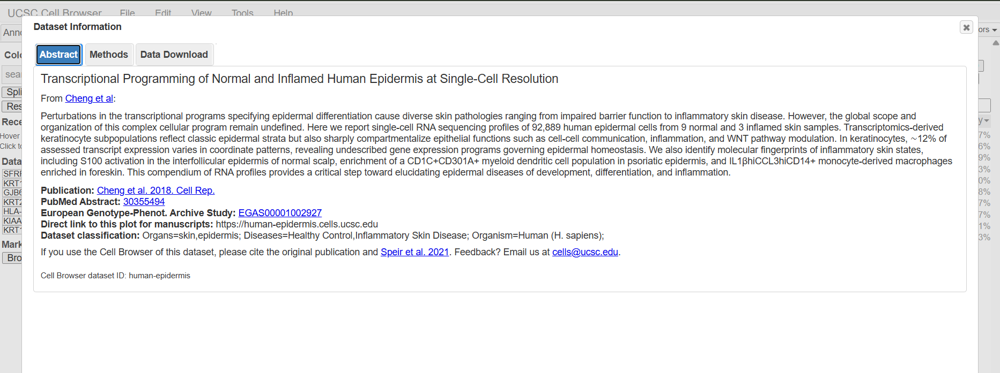
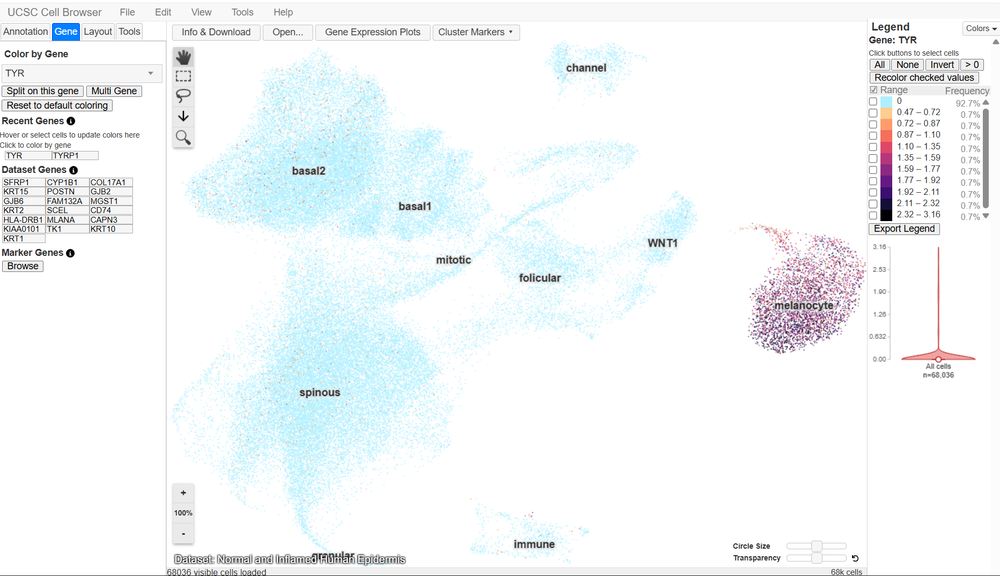
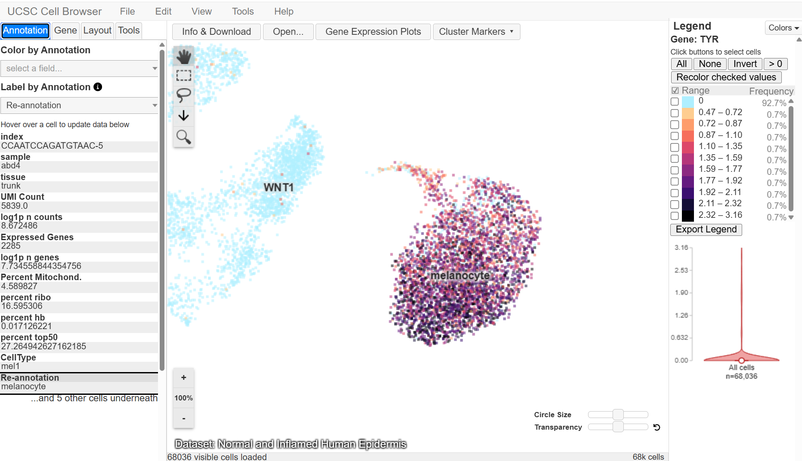
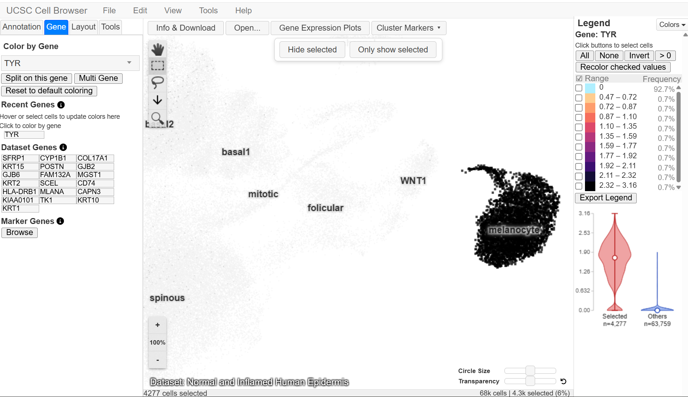
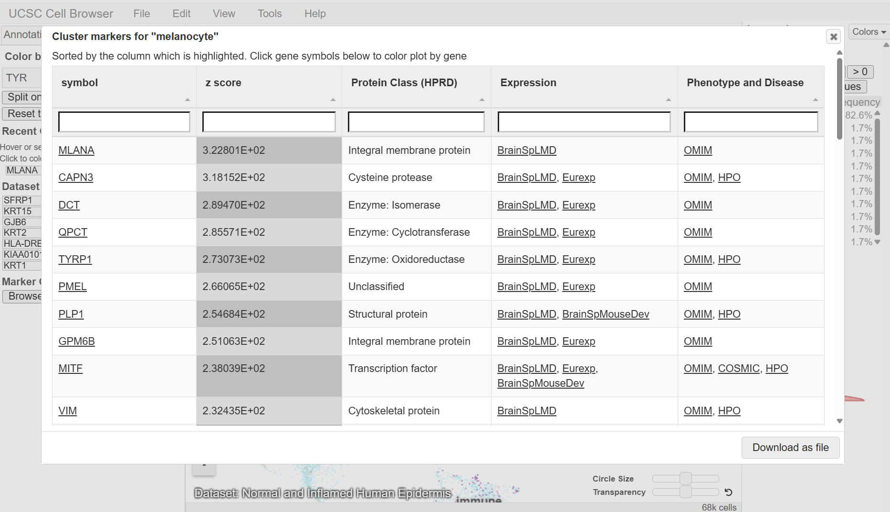

# Screenshots

This folder contains screenshots documenting the UCSC Cell Browser activity for the TYR gene associated with Oculocutaneous albinism type 1 (OCA1).

---

**Figure 1.** Dataset information for the Normal and Inflamed Human Epidermis single-cell dataset in the UCSC Cell Browser.

This screenshot presents the information for the selected Normal and Inflamed Human Epidermis dataset. The dataset represents human skin and epidermis and includes human (*H. sapiens*) samples, with the associated study titled *Transcriptional Programming of Normal and Inflamed Human Epidermis at Single-Cell Resolution*. The screenshot also shows the publication information, PubMed ID 30355494, study accession EGAS00001002927, and Cell Browser dataset ID `human-epidermis`.

## Screenshot 2: TYR Gene Expression Across the Cell Map

**Figure 2.** Expression of the human *TYR* gene across cells in the Normal and Inflamed Human Epidermis dataset.

The image shows the UMAP cell map after selecting TYR in the Gene tab of the UCSC Cell Browser. The individual dots represent cells, and their colors indicate the detected level of TYR expression according to the expression legend on the right side of the map. The legend identifies the selected gene as *TYR* and shows expression values ranging from 0 to 3.16. Most cells are displayed in very light colors, corresponding to little or no detectable TYR expression, while stronger expression is more apparent within the **melanocyte** cluster. The screenshot also shows the other labeled clusters, including spinuous, basal1, basal2, follicular, mitotic, WNT1, channel, and immune, allowing the distribution of TYR expression across the different cell populations to be observed.

## Screenshot 3: TYR Gene Expression and Cell-Type Annotation
 
 
 
**Figure 3.** TYR gene-expression map showing cell-type/cluster annotations in the Normal and Inflamed Human Epidermis dataset. 
 
Figure 3 shows the TYR gene-expression map in the UCSC Cell Browser with recognizable cell-type and cluster labels. The **melanocyte** cluster is clearly labeled and shows the strongest visible TYR expression, while other labeled clusters, including WNT1, show little or no detectable expression. The annotation panel on the left identifies the selected cell as **mel1** under CellType and **melanocyte** under Re-annotation. The expression legend on the right identifies the selected gene as *TYR* and shows the range of detected expression values. The map therefore provides visual evidence that *TYR* expression is concentrated in the melanocyte cluster rather than being broadly distributed across the cell populations.

## Screenshot 4: TYR Expression Plot in Selected Melanocyte Cells

**Figure 4.** Violin plot comparing TYR expression between selected melanocyte cells and other cells in the Normal and Inflamed Human Epidermis dataset.

Following the selection of cells within the melanocyte cluster, the UCSC Cell Browser generated a violin plot comparing their TYR expression with the remaining cells. The selected group contains 4,277 cells, while the comparison group labeled “Others” contains 63,759 cells. The distribution of expression values for the selected cells extends to higher levels, whereas the values for the other cells are concentrated mainly near zero. The plot therefore provides additional evidence that TYR expression is higher in the selected melanocyte cells compared with the background cell population.

## Screenshot 5: Marker Genes of the Melanocyte Cluster

**Figure 5.** Marker-gene information for the melanocyte cluster in the Normal and Inflamed Human Epidermis dataset.

Displayed in Figure 5 is the cluster-marker table for the melanocyte cell population in the UCSC Cell Browser. The heading “Cluster markers for ‘melanocyte’” identifies the cluster being examined, while the table lists genes associated with that cluster together with their corresponding z scores and additional information. The recorded marker genes *MLANA*, *DCT*, and *TYRP1* are visible in the table, with z scores of approximately **322.8, 289.5, and 273.1**, respectively. Other genes listed in the marker table include CAPN3, QPCT, PMEL, PLP1, GPM6B, MITF, and VIM. The marker-gene information provides additional evidence for characterizing the melanocyte cluster and allows its marker profile to be compared with the observed expression pattern of TYR.
